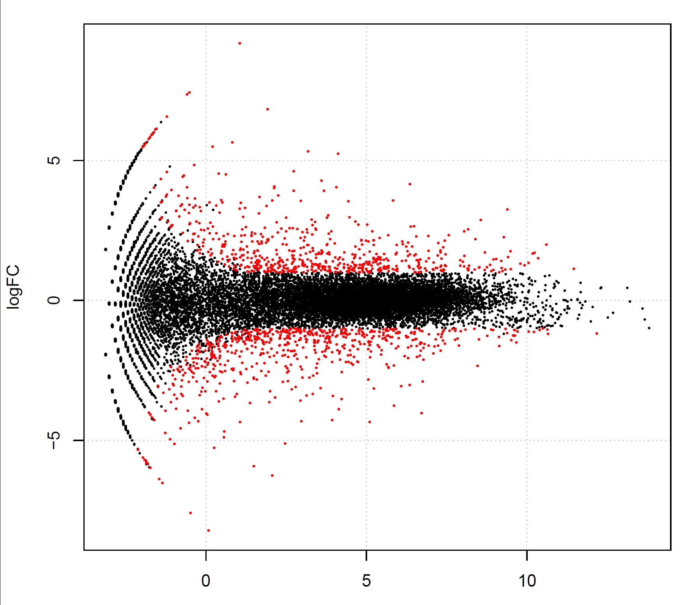
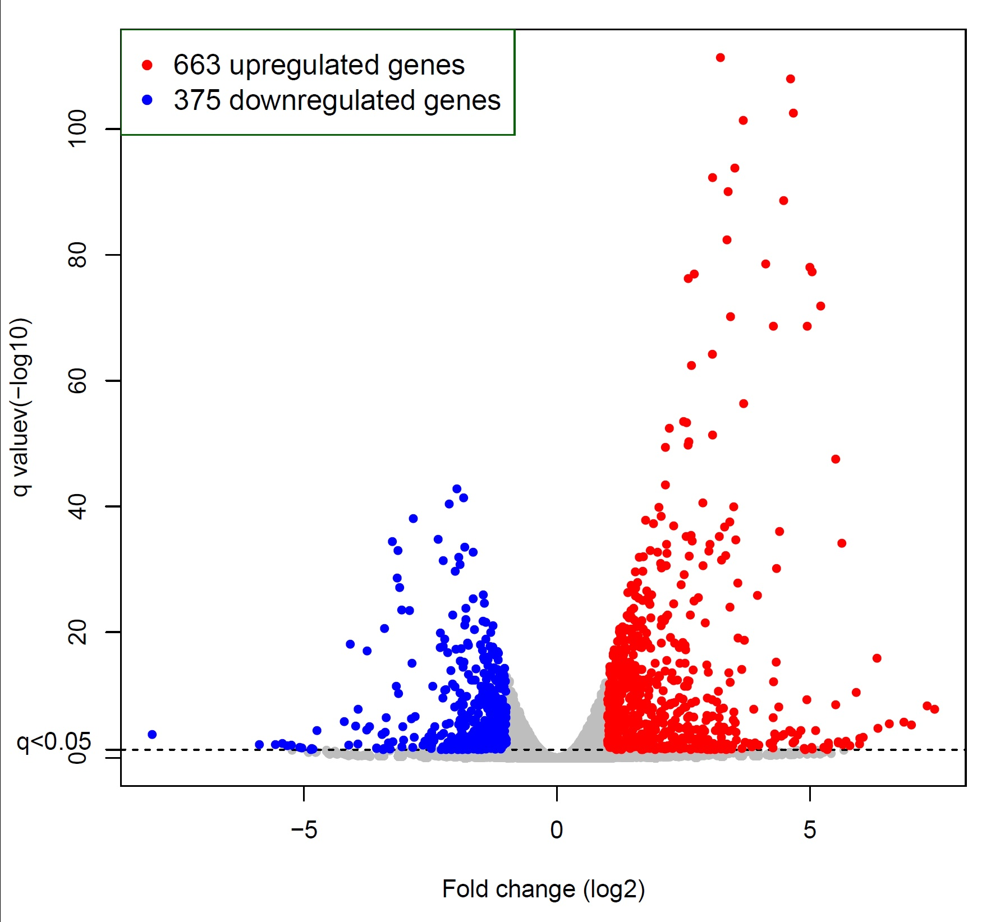

# BISC:Transcriptional-Bursting-Inference-using-Single-Cell-Transcriptoic-data

## Author: Xizhi Luo, Fei Qin, Feifei Xiao, Guoshuai Cai

## Description
Gene expression in mammalian cells is inherently stochastic that mRNA molecules are synthesized in discrete bursts. Although the advent of single cell transcriptomic technology provides great opportunities to explore the phenomenon of transcriptional bursting, current Beta-Poisson framework greatly suffers from substantial technical noise that leads to false estimations and conclusions. Statistical methods that account for complex nature of single cell transcriptomic data are needed to accurately reveal the heterogeneity of gene expression and infer kinetics parameters.
Here, we develop a Bayesian hierarchical framework, BISC, to study the stochastic gene expression kinetics. Gamma-Poisson model was employed to accommodate overdispersion of read counts, which was dynamically characterized by fitting the mean-variance relationship. The reliable estimation of the dispersion parameter is essential for capturing the expression heterogeneity, which improve the estimation of kinetics parameter. Also, we proposed a differential bursting analysis framework to identify heterogeneous bursting kinetics under different studying conditions.

## Required Packages
```r
library(rstan)
library(mgcv)
library(edgeR)
library(splatter)
> sessionInfo()
R version 4.1.1 (2021-08-10)
Platform: x86_64-w64-mingw32/x64 (64-bit)
Running under: Windows 10 x64 (build 19044)

Matrix products: default

locale:
[1] LC_COLLATE=English_United States.1252  LC_CTYPE=English_United States.1252    LC_MONETARY=English_United States.1252 LC_NUMERIC=C                           LC_TIME=English_United States.1252    

attached base packages:
[1] stats4    stats     graphics  grDevices utils     datasets  methods   base     

other attached packages:
 [1] splatter_1.18.2             SingleCellExperiment_1.16.0 SummarizedExperiment_1.24.0 Biobase_2.54.0              GenomicRanges_1.46.1        GenomeInfoDb_1.30.1        
 [7] IRanges_2.28.0              S4Vectors_0.32.4            BiocGenerics_0.40.0         MatrixGenerics_1.6.0        matrixStats_0.62.0          edgeR_3.36.0               
[13] limma_3.50.3                mgcv_1.8-36                 nlme_3.1-152                rstan_2.26.11               StanHeaders_2.26.11         BISC_0.0.0.9000            
[19] devtools_2.4.3              usethis_2.1.6  
```

## Running BISC
BISC can take gene expression read count data, to minimize unwanted heterogeneity, we recommended data generated from cells of the same population. BISC has three modelling options, 1) Poisson-Beta model (PB); 2) Poisson-Beta model with modification to enforce a mean-variance trend (PB-trend); 3) Poisson-Beta model with modifications to enforce a mean-variance trend and include dropout events (ZIPB-trend). 

## Install BISC
```r
library(devtools)
install_github("thecailab/BISC/BISC")
```
## Running BISC
BISC takes the read count input values.

## Examples
(1) Load read count data
```r
> count[1:10,1:5]
    NA19098.r3.D02 NA19101.r1.C10 NA19101.r3.B02 NA19239.r3.B02 NA19098.r2.G06
G1               1              0              0              0              0
G2               0              0              0              0              0
G3               1              0              4              3              0
G4               0              1              0              0              0
G5               0              0              0              0              0
G6               0              0              0              0              0
G7               0              0              0              0              0
G8               2              3              0              0              2
G9               4              4              2              3              4
G10              0              0              0              0              0
N=dim(count)[1]
K=dim(count)[2]
```
(2) BISC estimation with 3 models
### PB model
```r
result=BISC_estimate(data=count,model="PB",iter=4000)
```
### PB-trend model
```r
result=BISC_estimate(data=count,model="PB-trend",iter=4000)
```
### ZIPB-trend model
```r
result=BISC_estimate(data=count,model="ZIPB-trend",iter=4000)
```
(3) BISC output: we used the mean values of the posterior estimates of kon, koff and s.
```r
> head(result$estimation)
                 kon      koff         s
497097     0.2307866 9.9571430  26.97822
100503874  0.3697122 7.3681137  29.02944
27395     10.2944072 0.6382955 136.37340
18777      5.3132126 0.7275256  70.43799
100503730  3.2760650 3.4720868  34.19306
21399      8.8183328 0.5963465 124.00206
```
### Differential Bursting analysis 
To compare bursting kinetics between two studying groups A and B for each gene, BISC formulates a statistical testing framework based on the posterior MCMC samples of bursting parameters (BISC estimation step above).
```r
### BISC estimation for group A and B
result_A=BISC_estimate(data=count1,model="ZIPB-trend",iter=4000)
result_B=BISC_estimate(data=count2,model="ZIPB-trend",iter=4000)
### Posterior MCMC samples
BISC_A=result_A$MCMC
BISC_B=result_B$MCMC
DB_result=DB(data1=BISC_A,data2=BISC_B,frequency=0,size=0,log2=T)
```
Output
```r
> head(DB_result$test_frequency)
  Ha:kon>kona Ha:kon<kona    log2FC
1      0.0000      1.0000 1.1848702
2      0.0785      0.9215 1.9799065
3      0.2920      0.7080 0.2151745
4      0.0000      1.0000 0.3917844
5      0.0190      0.9810 0.1064826
6      0.0000      1.0000 4.8579631
```
```r
> head(DB_result$test_size)
  Ha:size>sizea Ha:size<sizea     log2FC
1        0.0050        0.9950   9.005440
2        0.6625        0.3375  -9.180905
3        0.5655        0.4345  -1.555786
4        0.0000        1.0000  13.655542
5        0.0375        0.9625  11.659518
6        0.0000        1.0000 235.586258
```
### MA plot and Volcano plot
```r
## MA plot
library(edgeR)
> pdf(file = "D:\\Desktop\\xizhi\\MA_plot_DB frequency Group A vs. B.pdf")
> plotSmear(test1,de.tags = genetags,main="DB frequency Group A vs. B")
> dev.off()
```

```r
## Volcano plot
> volcano_plot("volcano_plot_DB frequency Group A vs. B.pdf",comparison = test1,name = "DB frequency Group A vs. B")
> dev.off()
```


### Citation
Luo, Xizhi, Fei Qin, Feifei Xiao, and Guoshuai Cai. "BISC: accurate inference of transcriptional bursting kinetics from single-cell transcriptomic data." Briefings in Bioinformatics 23, no. 6 (2022).
